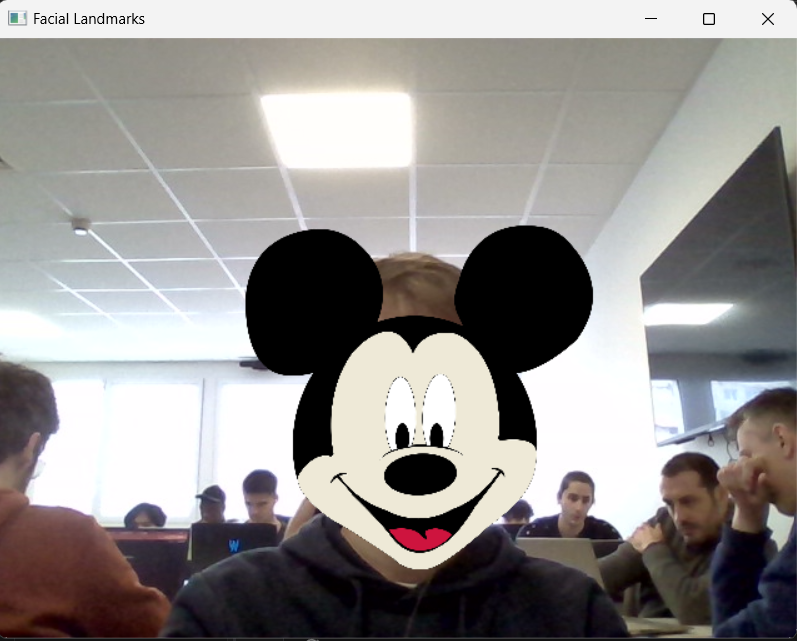

# Tensorflow filters on the face
Cette application simple développer en python va utiliser TensorFlow.js qui est un outil open source d'apprentissage automatique développé par google. Il est utiliser généralement pour l'Intelligence Artificiel dans les learning machines. Ici on utilise tensorflow pour afficher une image sur la tête qui suit le point 30(ce qui correspond au nez) dans une image donnée. L'application est construite sous la forme d'une fonction à laquelle on passe en paramètre le chemin de l'image souhaitée et un paramètre d'échelle pour définir la taille de l'image.



## Prérequis
Pour télécharger l'application  vous aurez besoin :
- Python 3.11 ou inférieur jusqu'à python 3.9
- TensorFlow.js
- Autre dépences (opencv-python, dlib, matplotlib, tkinter et pillow)

## Installation
1. Clonez ce dépôt sur une machine locale.
    ```bash
    git clone https://github.com/MattFreelanceWeb/tensorflow-face
    ```
2. Accédez au répertoire du projet (sur windows aller dans le répertoire faire un clique droit est séléctioner ouvrir dans le terminale)
    ```bash
    cd tesnorflow-face
    ```

3. Installez les dépendances.
    ```bash
    cd tensorflow-face
    ```

## Utilisation
```python
    from main import superposer_image_sur_visage

    # Utilisation de la fonction superposer_image_sur_visage
    image_path = "chemin/vers/votre/image.jpg"
    scale_factor = 1.5 # Ajuster ce paramètre selon vos besoins

    superposer_image_sur_visage(image_path, scale_factor)
```
## Contribuer
Si vous souhaitez contribuer à ce projet, n'hésitez pas à ouvrir une nouvelle issue ou à soumettre une pull request.